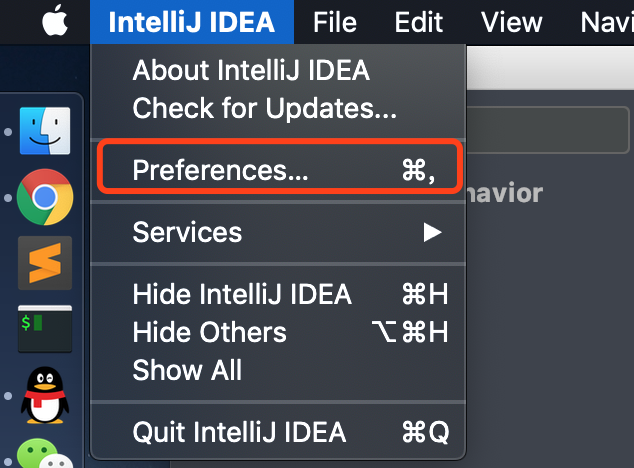
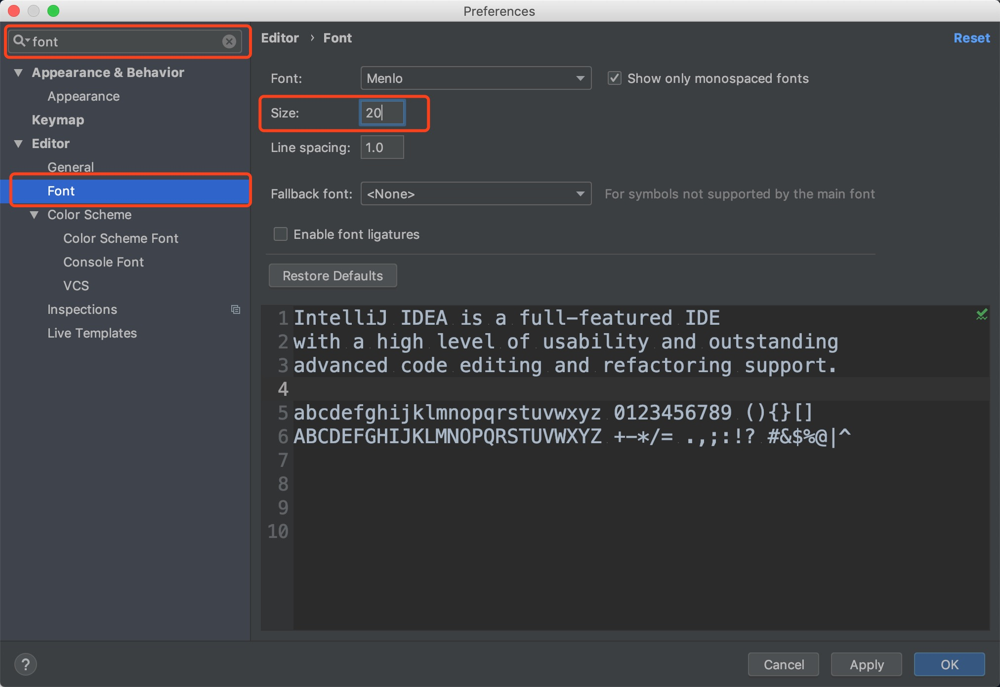
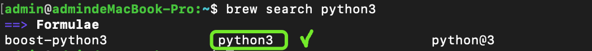
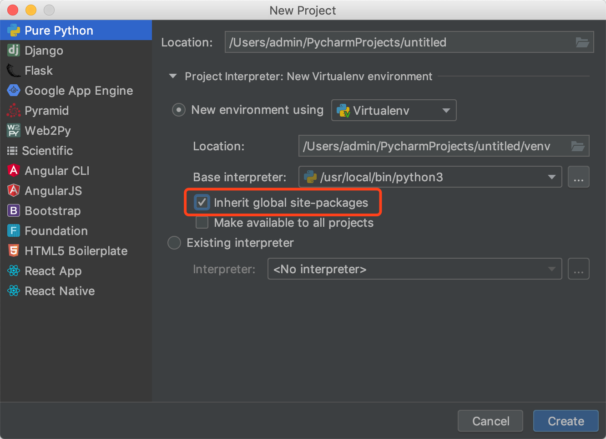

# macOS idea 调节字体大小
快捷键 command + ，




# 4-1用jpa来操纵数据库
# github创建空分支
```git
git checkout --orphan doc
#该命令会创建一个名为doc的分支，并且该分支下有前一个分支下的所有文件。
#删除命令
#我们不想提交任何内容，所以我们需要把当前内容全部删除，用git命令：
git rm -rf .
#提交分支
#使用commit命令来提交分支
git add *
git commit -am "init"
#如果没有任何文件提交的话，分支是看不到的，可以创建一个新文件后再次提交则#新创建的branch就会显示出来。
#使用branch来查看分支是否创建成功
git branch -a
#同步到github
git push --set-upstream origin doc

#合并分支
git checkout master
git merge doc
```
# github创建新分支并继承当前分支
```
git checkout -b newbranch
git add -A
git commit -m "end"
git push --set-upstream origin newbranch
```
# 数据库对象（表的映射）
写完DAO开始写service
# java复习
## implements使用
java中能够定义接口 接口是一种变相的抽象类 接口的定义可以实现java中的多继承问题 java中类与类之间只能单继承 关键字 是extends 而对于类来说可以实现接口 关键字就用implements 表示该类实现接口 接口与接口是也可以用extends来继承
extends是继承父类，只要那个类不是声明为final或者那个类定义为abstract的就能继承，JAVA中不支持多重继承，但是可以用接口来实现，这样就要用到implements，继承只能继承一个类，但implements可以实现多个接口，用逗号分开就行了
比如
class A extends B implements C,D,E
# git初始化注意事项
我经常向远程仓库提交的第一个文件就是.gitignore文件，这样后面就可以随意提交，不用担心将一些不必要的文件提交了。
# macOS idea跳到下一行 command + shift + enter
#  @Transactional注解在test下成功与否都不会写入数据库
# git删除远端分支 本地分支
git push origin 【空格】【冒号】【需要删除的分支名字】
比如我github上有master和doc分支，我现在想着删除doc分支，命令如下：
```git
git push origin --delete doc
git branch -D doc
```
# macOS .DS_Store文件处理
终端输入
```
defaults write com.apple.desktopservices DSDontWriteNetworkStores true
```
# @Entity作用
@entity是指这个类映射有数据库表，那么你不使用这个类时，后台应该不会对其进行处理吧，只有当你从数据库读取数据时，由于你要读取的表映射有实体类（@entity注释的），那么后台应该会自动帮你实例化一个对象，然后将数据库中的数据填充到对象中吧！


# 删除GIT中的.DS_Store||删除所有隐藏.DS_store
```
删除项目中的所有.DS_Store。这会跳过不在项目中的 .DS_Store
1.find . -name .DS_Store -print0 | xargs -0 git rm -f --ignore-unmatch
将 .DS_Store 加入到 .gitignore
2.echo .DS_Store >> ~/.gitignore
更新项目
3.git add --all
4.git commit -m '.DS_Store banished!'
```
# google国内注册（亲测）
手机号码在线接收注册地址,任意浏览器都可以
这是官方手机发送验证注册地址的网址:https://accounts.google.com/SignUpMobile


更改中国+86 ,填入手机号码,短信会接收到一个注册的短网址,把短网址复制输入到任意浏览器打开.按照提示来完成.

代理很重要!代理很重要!代理很重要!

# brew安装
```
/usr/bin/ruby -e "$(curl -fsSL https://raw.githubusercontent.com/Homebrew/install/master/install)"
```
# macOS安装python3
安装前先搜索一下是否已经存在python3的包：

```shell
brew search python3
```



已经存在，我们可以直接安装了：

```
brew install python3
brew link python3
brew info python3
python3 -V
```


发现python3被安装到了/usr/local/bin/python3目录下

# pycharm




```python
#!/usr/bin/env python 
# -*- coding:utf-8 -*-
__author__='$USER'

if __name__ == '__main__':
    print("Hello Python")
```


```python
#!/usr/bin/env python 
# -*- coding:utf-8 -*-
__author__ = 'admin'
    
    
if __name__ == '__main__':
    print("Hello Python")

```

# 实体类定好->写DAO层
# dao层就是数据库的一些增删改查，相对来说比较简单；而controller层是数据的展现，也比较简单；所有的逻辑我们都放service层（最复杂）
# product_not_exist变成大写,快捷键 command+shift+u

# 快捷键command+e效果图


